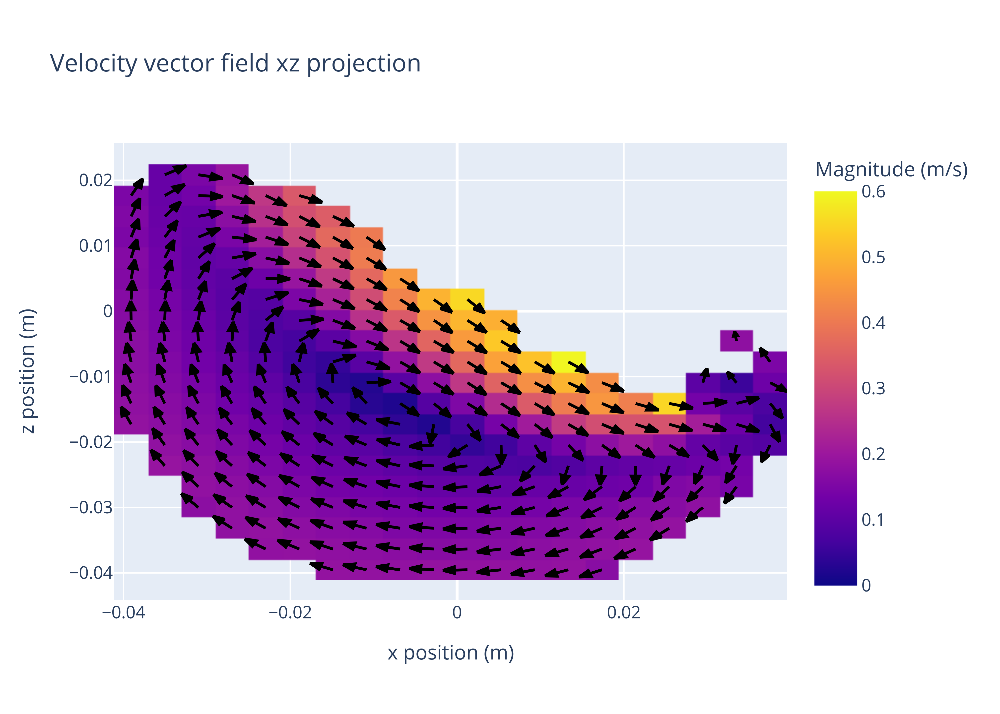

**************
Basic Tutorial
**************
The usual workflow in up4 consists of 4 steps: Converting, Generating grids, Analysis, and Plotting or short CGAP.
This basic tutorial will go through each element in CGAP and explain what it does and how to use it.

Data analysis
-------------

Data analysis is done by methods of the :code:`up4.Data` class. The most important methods are:

- :code:`up4.Data.vectorfield`: Calculates the velocity vector field of the data
- :code:`up4.Data.velocityfield`: Calculates the magnitude velocity field of the data
- :code:`up4.Data.numberfield`: Calculates the number field of the data

.. code-block:: python

    import up4
    data = up4.Data("path/to/data.hdf5")
    grid_car = up4.Grid.cartesian_from_data(data, cells =[20,20,20])
    velocity_field = data.velocityfield(grid_car)

All functions can be called with any type of grid.
The velocity field in this example can also be calculated in cylindrical coordinates:

.. code-block:: python

    import up4
    data = up4.Data("path/to/data.hdf5")
    grid_cyl = up4.Grid.cylindrical_from_data(data, cells =[20,20,20])
    velocity_field = data.velocityfield(grid_cyl)

Data Visualisation
------------------

.. TODO update

Visualisation is done by :code:`up4.Plotter2D`, which can visualise scalar and vector
fields in 2D.

If we reuse the example from above, plotting can be done by adding the following lines:

.. code-block:: python

    from up4.plotting import Plotter2D
    dpi = 600 # nice quality image saving
    axis = 1 # look along y-axis
    index = 4
    vector_field = data.vector_field(grid) # for vector plotting

    # style plot
    layout = dict(
        title = "Velocity vector field xz projection",
        xaxis_title = "x position (m)",
        yaxis_title = "z position (m)",
    )
    style = dict(
        colorbar_title = "Magnitude (m/s)",
        zmin = 0.0,
        zmax = 0.6,
    )

    # plot vector field
    vec_field_plotter = Plotter2D(vector_field)
    vec_fig = vec_field_plotter.unit_vector_plot(
        axis = axis, 
        index = index, 
        selection = "plane", 
        layout = layout, 
        style = style
    )

    #save plot 
    up4.save_fig(vec_fig, "unitv.png", dpi=dpi)

Which, looks a little like this:

